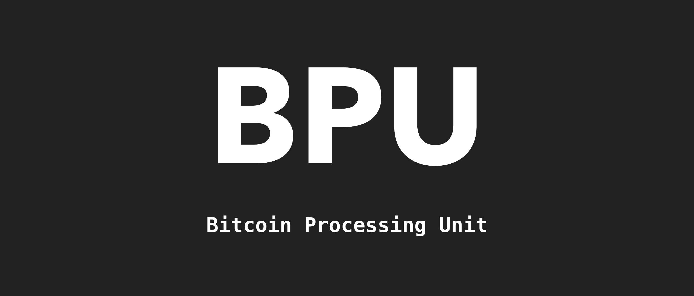

# go-bpu
> Transform Bitcoin Transactions into Virtual Procedure Call Units (Bitcoin Processing Unit)



[](https://github.com/BitcoinSchema/go-bpu/releases)
[](https://github.com/BitcoinSchema/go-bpu/actions)
[](https://golang.org/)
<br>
[](https://mergify.io)
[](https://github.com/sponsors/BitcoinSchema)
[](https://gobitcoinsv.com/#sponsor?utm_source=github&utm_medium=sponsor-link&utm_campaign=go-bpu&utm_term=go-bpu&utm_content=go-bpu)
<br>

Transforms raw transactions to BOB format. Port from the original [bpu](https://github.com/interplanaria/bpu) library by [unwriter](https://github.com/unwriter)

Since this is intended to be used by low level transaction parsers dependencies are kept to a bare minimum. It does not include the RPC client functionality that connects to a node to get a raw tx. It's designed to be a fast raw tx to BOB processor.

There is also a [Typescript version](https://github.con/rohenaz/bpu-ts) which does include the originally RPC functionality.

## Installation

**go-bpu** requires a [supported release of Go](https://golang.org/doc/devel/release.html#policy).

```shell script
go get -u github.com/bitcoinschema/go-bpu
```

<br/>

## Documentation

View the generated [documentation](https://pkg.go.dev/github.com/bitcoinschema/go-bpu)

[](https://pkg.go.dev/github.com/bitcoinschema/go-bpu)

<br/>

## Usage

### Split Config

```go
var seperator = "|"
var l = bpu.IncludeL
var opReturn = uint8(106)
var opFalse = uint8(0)

var splitConfig = []SplitConfig{
	{
		Token: &Token{
			Op: &opReturn,
		},
		Include: &l,
	},
	{
		Token: &Token{
			Op: &opFalse,
		},
		Include: &l,
	},
	{
		Token: &Token{
			S: &seperator,
		},
    Require: &opFalse,
	},
}

bpuTx, err := Parse(ParseConfig{RawTxHex: &sampleTx, SplitConfig: splitConfig})
if err != nil {
  fmt.Println(err)
}
```

### Transaction Source

You can either use SplitConfig.RawTxHex and set by hex string, or use SplitConfig.Tx to set by bt.Tx.

### Transform Function

You can pass an optional Transform function to bpu.Parse. Function should look something like this:

```go
var splitTransform Transform = func(o Cell, c string) (to *Cell, e error) {
	// if the buffer is larger than 512 bytes,
	// replace the key with "l" prepended attribute
	to = &o
	bytes, err := hex.DecodeString(c)
	if err != nil {
		return nil, err
	}
	if len(bytes) > 512 {
		to.LS = to.S
		to.LB = to.B
		to.S = nil
		to.B = nil
	}
	return to, nil
}
```

<br/>

## More Usage details

See the [Typescript library](https://github.com/rohenaz/bpu-ts) README for more examples of split configuration options, transformation, and a look at the output.

## Errata

The original BPU library used bsv (javascript) v1.5 to determine if a script chunk was a valid opcode. At the time, the bsv library supported a limited number of OP codes (inherited from limitations imposed by Bitcoin core). In this version all opcodes are recognized which surfaces a new issue where fields previously available would be missing if the data is now recognized as an opcode.

Previously, BPU would omit the op and ops fields for non opcode data, while recognized opcodes would omit the s, b and h fields. To solve the issue of missing fields that happen to be opcodes, all keys are included if the recognized pushdata is also in the Printable ASCII range.

<br/>

## Contributing

View the [contributing guidelines](.github/CONTRIBUTING.md) and follow the [code of conduct](.github/CODE_OF_CONDUCT.md).

### How can I help?

All kinds of contributions are welcome :raised_hands:!
The most basic way to show your support is to star :star2: the project, or to raise issues :speech_balloon:.
You can also support this project by [becoming a sponsor on GitHub](https://github.com/sponsors/BitcoinSchema) :clap:
or by making a [**bitcoin donation**](https://gobitcoinsv.com/#sponsor?utm_source=github&utm_medium=sponsor-link&utm_campaign=go-bpu&utm_term=go-bpu&utm_content=go-bpu) to ensure this journey continues indefinitely! :rocket:

[](https://github.com/BitcoinSchema/go-bpu/stargazers)

<br/>

## License

[](LICENSE)
